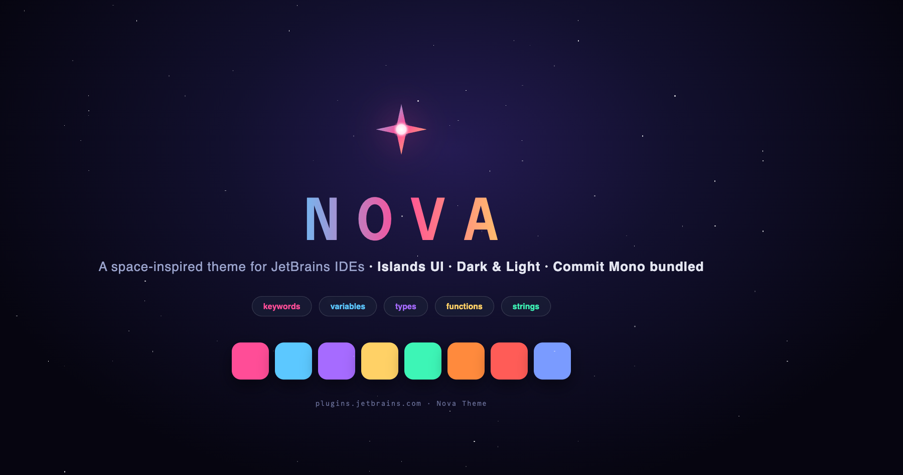
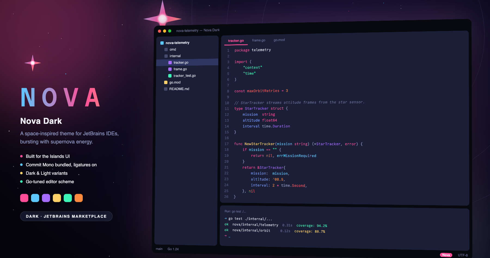
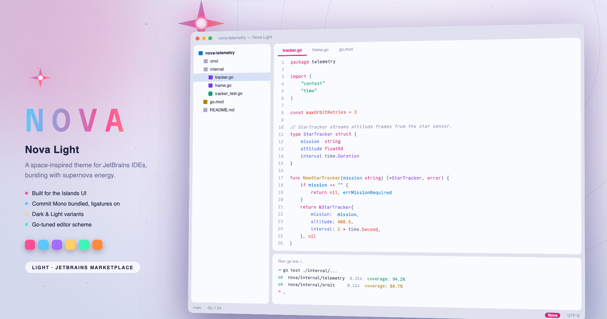

# Nova Theme

[](https://plugins.jetbrains.com/plugin/32800-nova-theme)

A vibrant, space-inspired theme for GoLand and all JetBrains IDEs, built for the [Islands UI](https://blog.jetbrains.com/platform/2025/12/meet-the-islands-theme-the-new-default-look-for-jetbrains-ides/) and tuned for Go. Editor and tool windows float as rounded islands over a deep-space canvas, and the syntax palette bursts with supernova energy.

Get it on the [JetBrains Marketplace](https://plugins.jetbrains.com/plugin/32800-nova-theme).



## Variants

| Theme | Look |
|-------|------|
| **Nova Dark** | Deep-space navy islands (`#1A1E36`) over a near-black cosmic canvas (`#08090F`). |
| **Nova Light** | Bright stellar islands (`#FAFBFF`) over a soft nebula canvas (`#DFE2EE`), accents corrected for daylight contrast. |
| **Nova Dark High Contrast** | Pure black canvas with brighter accents, for high-glare screens and accessibility. |
| **Nova Dim** | A softer, lower-contrast dark variant for long sessions. |
| **Nova Dark Classic** / **Nova Light Classic** | The same palettes without the Islands layout, for the classic New UI look. |





Requires IDE version 2025.2 or newer.

## What is themed

Beyond the editor and the tool windows, Nova colors the parts of the IDE that most themes leave on their defaults:

- **Go**: struct tags, build constraints, structs versus interfaces, method receivers, shadowed variables, builtin values and functions, doc comment references, `go fix` syntax updates, and Go templates.
- **Profiler**: flame graphs, CPU and memory charts, chart sliders and timers, and the line profiling gutter.
- **Terminal**: the block terminal with its own ANSI palette, block backgrounds, selection and error strokes, and the command prompt separator.
- **Debugging and tests**: execution point, breakpoints, inline values, evaluated expressions, smart step into, and test coverage gutters.
- **AI**: inline suggestions, inline prompt, AI inlay buttons and next-edit diff highlights.
- **Version control**: file status colors in the project tree, annotation stripes, log references, merge status, and diff and merge backgrounds.
- **Editor extras**: inlay hints, breadcrumbs, bookmarks, TODO, typos and grammar, deprecation, live templates, rainbow brackets and search result highlighting.
- **Languages**: YAML, JSON, Markdown, Terraform HCL, Protobuf, Docker Compose, Kubernetes, SQL, HTTP client, XML, HTML, CSS, properties and regular expressions.

## Bundled font

Nova ships with [Commit Mono](https://commitmono.com) (SIL OFL 1.1), a neutral coding font with smart kerning and ligatures. The font is registered with the IDE at startup, and the first time a Nova color scheme is active the plugin offers it through a notification. Nothing is installed into your system font directory and your editor font is never changed without asking.

## Palette

| Role | Dark | Light |
|------|------|-------|
| Canvas | `#08090F` | `#DFE2EE` |
| Island / editor | `#1A1E36` | `#FAFBFF` |
| Foreground | `#E4E6F1` | `#262B45` |
| Supernova magenta (keywords, operators, accent) | `#FF4D97` | `#D6247A` |
| Electric cyan (variables, links, caret) | `#5CC8FF` | `#0A78C8` |
| Nebula purple (types) | `#A66BFF` | `#7C3AED` |
| Star gold (functions) | `#FFD166` | `#B4830B` |
| Aurora green (strings) | `#3DF5B6` | `#0B9E6E` |
| Plasma orange (numbers) | `#FF8A3D` | `#D96B0A` |
| Red giant (constants, errors) | `#FF5C57` | `#E0403A` |
| Star blue (fields) | `#7A9BFF` | `#4A6BE0` |

The high contrast and dim variants shift the same roles, keeping the hue relationships intact.

## Install

From [JetBrains Marketplace](https://plugins.jetbrains.com/plugin/32800-nova-theme): search for "Nova Theme" in `Settings | Plugins | Marketplace`.

From disk:

1. Download the signed jar from the [latest release](https://github.com/victoragudo/nova-theme/releases/latest).
2. Go to `Settings | Plugins`.
3. Click the gear icon and select `Install Plugin from Disk...`.
4. Pick the downloaded jar.
5. Restart the IDE and select a Nova variant under `Settings | Appearance & Behavior | Appearance | Theme`.

## Build from source

Themes and editor schemes are generated from a single palette definition in `tools/palette.py`, so every variant stays in sync.

```bash
python3 tools/generate_themes.py                     # regenerate themes/ from the palettes
python3 tools/validate_themes.py [path/to/IDE]       # check every key against an installed IDE
python3 tools/build_plugin.py [path/to/IDE]          # compile the listener and package the jar
```

Sign the jar for the Marketplace with the [JetBrains zip signer](https://github.com/JetBrains/marketplace-zip-signer), using the certificate and key in `signing/`:

```bash
java -jar marketplace-zip-signer-cli.jar sign \
  -in Nova-Theme-<version>.jar -out Nova-Theme-<version>-signed.jar \
  -cert-file signing/nova-chain.crt -key-file signing/nova-private.pem
java -jar marketplace-zip-signer-cli.jar verify \
  -in Nova-Theme-<version>-signed.jar -cert signing/nova-chain.crt
```

Both scripts default to `~/Applications/GoLand.app/Contents`. Pass the `Contents` directory of any installed 2025.2+ IDE to use a different one. `build_plugin.py` compiles `src/com/victoragudo/nova/NovaFontRegistrar.java` against the IDE jars with the bundled JBR and writes `Nova-Theme-<version>.jar` next to the sources.

## License

Theme: MIT. Bundled Commit Mono font: SIL Open Font License 1.1 (see `fonts/LICENSE-CommitMono.txt`).
